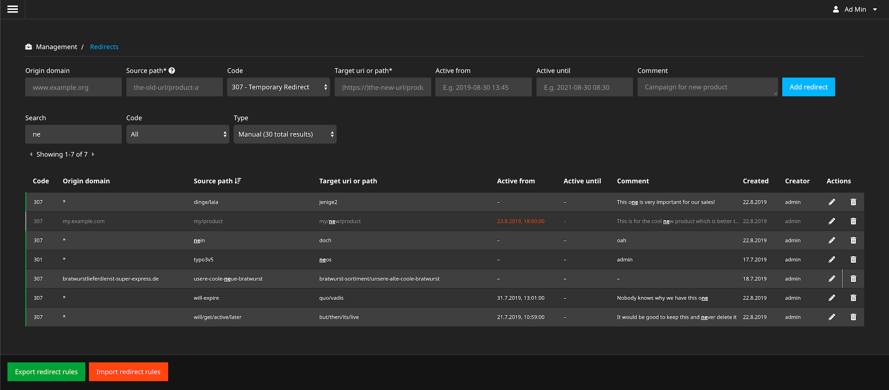

# Neos.RedirectHandler.Ui

This package provides a backend module to manage [Neos.RedirectHandler](https://github.com/neos/redirecthandler) redirects which are stored in [Neos.RedirectHandler.DatabaseStorage](https://github.com/neos/redirecthandler-databasestorage).

## Compatibility and Maintenance

This package is compatible with Neos 3.x, 4.x and will be maintained for upcoming versions.

## Installation

1. Run the following command in your site package

    composer require neos/redirecthandler-ui
    
2. Then run `composer update` in your projects root folder.
3. Then you can add the `RedirectAdministrator` role to the users who need access to the new backend module.

## Screenshots

Listing and editing redirects:

Search & filter redirects:

## Contributing

Please create issues on [Github](https://github.com/neos/redirecthandler-ui) if you encounter bugs or other issues.

### Working on the code

The basis of the backend module is built with Fusion and the UI for managing the redirects
is built with *React* and *Typescript*.

#### Recompiling the js and css parts

1. Use *nvm* so you have the correct *npm* version.
2. Run `npm install` in the package folder.
3. Run `npm run watch` during development or `npm run build` for a new release.
             
## License

THE SOFTWARE IS PROVIDED "AS IS", WITHOUT WARRANTY OF ANY KIND, EXPRESS OR IMPLIED, INCLUDING BUT NOT LIMITED TO THE WARRANTIES OF MERCHANTABILITY, FITNESS FOR A PARTICULAR PURPOSE AND NONINFRINGEMENT. IN NO EVENT SHALL THE AUTHORS OR COPYRIGHT HOLDERS BE LIABLE FOR ANY CLAIM, DAMAGES OR OTHER LIABILITY, WHETHER IN AN ACTION OF CONTRACT, TORT OR OTHERWISE, ARISING FROM, OUT OF OR IN CONNECTION WITH THE SOFTWARE OR THE USE OR OTHER DEALINGS IN THE SOFTWARE.
